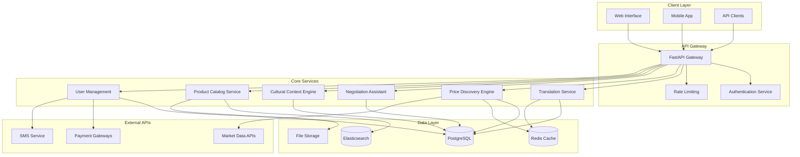

# Design Document: Multilingual Mandi Challenge Platform

## Overview

The Multilingual Mandi Challenge platform is a Python-based web application that revolutionizes local trade in India through AI-driven price discovery and cross-language negotiation tools. The platform leverages modern Python frameworks, specialized Indian language NLP libraries, and real-time communication technologies to create an inclusive trading environment for vendors with varying technological literacy levels.

The system architecture follows a microservices approach with FastAPI as the core web framework, providing high-performance async capabilities essential for real-time features. The platform integrates multiple AI services including translation, price discovery, and cultural context understanding to bridge language barriers and facilitate transparent trade.

## Architecture

### High-Level Architecture



### Technology Stack

**Web Framework**: FastAPI with Uvicorn ASGI server
- Chosen for high-performance async capabilities (10,000+ req/s)
- Built-in API documentation and validation
- WebSocket support for real-time features
- Modern Python async/await support

**Database**: PostgreSQL with Redis caching
- PostgreSQL for transactional data and complex queries
- Redis for session management, caching, and real-time data

**Search Engine**: Elasticsearch
- Full-text search across multiple Indian languages
- Product catalog indexing and filtering
- Analytics and reporting capabilities

**NLP Libraries**:
- **iNLTK**: Primary library for Indian language processing
- **Indic NLP Library**: Text preprocessing and normalization
- **Google Translate API**: Fallback translation service
- **spaCy**: Named entity recognition and text analysis

## Components and Interfaces

### Translation Service

**Purpose**: Provides real-time translation between supported Indian languages while preserving cultural context and market terminology.

**Key Components**:
- **Language Detector**: Identifies input language automatically
- **Translation Engine**: Multi-model approach using iNLTK and Google Translate
- **Context Preserver**: Maintains market-specific terminology and cultural nuances
- **Cache Manager**: Stores frequently used translations for performance

**Interface**:
```python
class TranslationService:
    async def translate_text(
        self, 
        text: str, 
        source_lang: str, 
        target_lang: str,
        context: Optional[str] = None
    ) -> TranslationResult
    
    async def detect_language(self, text: str) -> LanguageDetectionResult
    
    async def translate_with_context(
        self,
        text: str,
        source_lang: str,
        target_lang: str,
        market_context: MarketContext
    ) -> ContextualTranslationResult
```

### Price Discovery Engine

**Purpose**: Analyzes market data to provide real-time price recommendations and trends for local products.

**Key Components**:
- **Market Data Collector**: Aggregates pricing from multiple sources
- **Price Analyzer**: ML models for price prediction and trend analysis
- **Location Adjuster**: Adjusts prices based on geographical factors
- **Confidence Calculator**: Provides reliability scores for price recommendations

**Interface**:
```python
class PriceDiscoveryEngine:
    async def get_current_price(
        self,
        product_id: str,
        location: Location,
        quality_grade: Optional[str] = None
    ) -> PriceRecommendation
    
    async def get_price_trends(
        self,
        product_id: str,
        location: Location,
        days: int = 30
    ) -> PriceTrendData
    
    async def predict_price_movement(
        self,
        product_id: str,
        location: Location,
        forecast_days: int = 7
    ) -> PriceForecast
```

### Negotiation Assistant

**Purpose**: Facilitates cross-language negotiations with cultural awareness and automated suggestion capabilities.

**Key Components**:
- **Negotiation State Manager**: Tracks negotiation progress and history
- **Cultural Advisor**: Provides culturally appropriate responses and strategies
- **Compromise Suggester**: AI-powered mediation for deadlocked negotiations
- **Communication Logger**: Maintains audit trail of all negotiations

**Interface**:
```python
class NegotiationAssistant:
    async def start_negotiation(
        self,
        buyer_id: str,
        vendor_id: str,
        product_id: str,
        initial_offer: Decimal
    ) -> NegotiationSession
    
    async def process_offer(
        self,
        session_id: str,
        offer: NegotiationOffer
    ) -> NegotiationResponse
    
    async def suggest_compromise(
        self,
        session_id: str
    ) -> List[CompromiseSuggestion]
```

### Cultural Context Engine

**Purpose**: Understands and adapts to regional market customs, communication styles, and business practices.

**Key Components**:
- **Regional Profiler**: Maintains profiles of different market regions
- **Communication Styler**: Adapts language tone and formality
- **Custom Recognizer**: Identifies local customs and practices
- **Relationship Tracker**: Manages vendor-buyer relationship history

**Interface**:
```python
class CulturalContextEngine:
    async def get_regional_context(
        self,
        location: Location
    ) -> RegionalContext
    
    async def adapt_communication_style(
        self,
        message: str,
        sender_profile: UserProfile,
        receiver_profile: UserProfile
    ) -> AdaptedMessage
    
    async def suggest_negotiation_approach(
        self,
        vendor_profile: VendorProfile,
        buyer_profile: BuyerProfile,
        product_category: str
    ) -> NegotiationStrategy
```

## Data Models

### Core Entities

**User Model**:
```python
class User(BaseModel):
    id: UUID
    phone_number: str
    preferred_language: LanguageCode
    location: Location
    tech_literacy_level: TechLiteracyLevel
    verification_status: VerificationStatus
    created_at: datetime
    last_active: datetime
```

**Vendor Model**:
```python
class Vendor(User):
    business_name: str
    business_type: BusinessType
    specializations: List[ProductCategory]
    rating: Decimal
    total_transactions: int
    market_reputation: MarketReputation
    payment_methods: List[PaymentMethod]
```

**Product Model**:
```python
class Product(BaseModel):
    id: UUID
    vendor_id: UUID
    name: MultilingualText
    category: ProductCategory
    description: MultilingualText
    base_price: Decimal
    unit: MeasurementUnit
    quality_grade: QualityGrade
    availability: AvailabilityStatus
    images: List[ImageURL]
    location: Location
    seasonal_availability: SeasonalPattern
```

**Negotiation Session Model**:
```python
class NegotiationSession(BaseModel):
    id: UUID
    buyer_id: UUID
    vendor_id: UUID
    product_id: UUID
    status: NegotiationStatus
    current_offer: Decimal
    counter_offer: Optional[Decimal]
    messages: List[NegotiationMessage]
    cultural_context: CulturalContext
    started_at: datetime
    expires_at: datetime
```

### Supporting Models

**Translation Cache Model**:
```python
class TranslationCache(BaseModel):
    source_text: str
    source_language: LanguageCode
    target_language: LanguageCode
    translated_text: str
    context_hash: str
    confidence_score: float
    created_at: datetime
    usage_count: int
```

**Price History Model**:
```python
class PriceHistory(BaseModel):
    id: UUID
    product_id: UUID
    location: Location
    price: Decimal
    quality_grade: QualityGrade
    source: PriceSource
    timestamp: datetime
    market_conditions: MarketConditions
```

## Correctness Properties

*A property is a characteristic or behavior that should hold true across all valid executions of a system—essentially, a formal statement about what the system should do. Properties serve as the bridge between human-readable specifications and machine-verifiable correctness guarantees.*

### Property 1: Translation Consistency and Context Preservation
*For any* message in any supported Indian language, when translated to another supported language, the translation should preserve market-specific terminology and cultural context while maintaining semantic accuracy.
**Validates: Requirements 1.2, 1.3**

### Property 2: Language Interface Completeness
*For any* supported language selection, all user interface elements should be displayed in that language, and switching languages should preserve all session data and user context.
**Validates: Requirements 1.1, 1.5**

### Property 3: Price Discovery Accuracy and Timeliness
*For any* product listing with sufficient market data, the price discovery engine should provide price recommendations that consider location, seasonality, quality grades, and demand patterns, with appropriate confidence indicators when data is insufficient.
**Validates: Requirements 2.1, 2.3, 2.4**

### Property 4: Real-time Price Updates
*For any* market condition change, price recommendations should be updated and propagated to all relevant users within the specified timeframes.
**Validates: Requirements 2.2**

### Property 5: Historical Price Data Availability
*For any* product category, the system should provide price trend data covering the past 30 days and maintain historical data for analysis.
**Validates: Requirements 2.5, 5.5**

### Property 6: Negotiation Communication Flow
*For any* negotiation session between users speaking different languages, all messages should be translated bidirectionally with automatic unit and currency conversion, while maintaining a complete audit trail.
**Validates: Requirements 3.1, 3.2, 3.5**

### Property 7: Cultural Negotiation Adaptation
*For any* negotiation context, the system should provide culturally appropriate suggestions and strategies based on regional customs and relationship history.
**Validates: Requirements 3.3, 6.1, 6.2, 6.5**

### Property 8: Negotiation Deadlock Resolution
*For any* negotiation that reaches an impasse, the system should generate compromise suggestions based on market data and cultural context.
**Validates: Requirements 3.4**

### Property 9: Multilingual Search Functionality
*For any* search query in any supported language, the product catalog should return relevant results with complete information (images, prices, ratings, availability) within performance requirements.
**Validates: Requirements 7.1, 7.2, 7.3**

### Property 10: Search Filtering and Recommendations
*For any* search with applied filters (location, price, quality, delivery), results should match all filter criteria, and out-of-stock items should trigger alternative suggestions.
**Validates: Requirements 7.4, 7.5**

### Property 11: Market Data Consistency and Freshness
*For any* market data query, the system should provide current availability information from multiple sources, including transportation costs and delivery timeframes, with regular updates every 15 minutes.
**Validates: Requirements 5.1, 5.2, 5.3**

### Property 12: Alert and Notification Timeliness
*For any* market alert trigger, relevant vendors should be notified within 1 minute with appropriate escalation for urgent situations.
**Validates: Requirements 5.4, 10.4**

### Property 13: Localization and Cultural Adaptation
*For any* product display or communication, the system should use locally familiar names, support traditional measurement units alongside metric units, and adapt to regional preferences.
**Validates: Requirements 6.3, 6.4**

### Property 14: Error Handling and Localization
*For any* error condition, the system should display clear, actionable error messages in the user's preferred language.
**Validates: Requirements 4.4**

### Property 15: Security and Audit Trail Integrity
*For any* user communication or transaction, the system should apply industry-standard encryption and maintain complete audit logs with proper escalation for suspicious activities.
**Validates: Requirements 8.1, 8.3, 8.4, 8.5**

### Property 16: Analytics and Reporting Completeness
*For any* vendor analytics request, the system should generate reports containing all required data elements (price trends, demographics, seasonal patterns) for the specified time periods with accurate comparative analysis.
**Validates: Requirements 10.1, 10.2, 10.5**

### Property 17: Predictive Analytics Accuracy
*For any* demand forecasting request, the system should generate predictions with measurable accuracy metrics and confidence intervals.
**Validates: Requirements 10.3**

<function_calls>
<invoke name="prework">
<parameter name="featureName">multilingual-mandi-platform

## Error Handling

### Translation Service Error Handling

**Language Detection Failures**:
- Fallback to user's preferred language when auto-detection fails
- Provide manual language selection option
- Log detection failures for model improvement

**Translation Quality Issues**:
- Implement confidence scoring for translations
- Provide "Show Original" option for low-confidence translations
- Allow user feedback on translation quality
- Maintain fallback to Google Translate API when iNLTK fails

**Performance Degradation**:
- Implement circuit breaker pattern for external translation APIs
- Cache frequently used translations to reduce API calls
- Provide graceful degradation with simplified translations

### Price Discovery Error Handling

**Insufficient Market Data**:
- Display confidence levels and data limitations clearly
- Provide historical averages when current data unavailable
- Show data source transparency to users
- Implement data quality scoring

**API Failures**:
- Implement retry logic with exponential backoff
- Maintain local cache of recent price data
- Provide "Last Updated" timestamps
- Graceful fallback to cached or estimated prices

**Calculation Errors**:
- Validate all input parameters before processing
- Implement bounds checking for price recommendations
- Log calculation anomalies for investigation
- Provide manual override capabilities for administrators

### Real-time Communication Error Handling

**WebSocket Connection Issues**:
- Implement automatic reconnection with exponential backoff
- Maintain message queue for offline periods
- Provide connection status indicators to users
- Fallback to HTTP polling when WebSocket unavailable

**Message Delivery Failures**:
- Implement message acknowledgment system
- Retry failed messages with increasing intervals
- Provide delivery status indicators
- Store undelivered messages for later retry

### Database and Data Consistency

**Transaction Failures**:
- Implement database transaction rollback mechanisms
- Use optimistic locking for concurrent updates
- Provide data consistency checks and repair tools
- Maintain audit logs for all data modifications

**Cache Inconsistency**:
- Implement cache invalidation strategies
- Use cache versioning for critical data
- Provide cache warming for frequently accessed data
- Monitor cache hit rates and performance

## Testing Strategy

### Dual Testing Approach

The testing strategy employs both unit testing and property-based testing to ensure comprehensive coverage:

**Unit Tests**: Focus on specific examples, edge cases, and integration points
- Specific translation examples with known correct outputs
- Error condition handling and edge cases
- Integration between components
- API endpoint validation with sample data

**Property Tests**: Verify universal properties across all inputs
- Translation consistency across all language pairs
- Price calculation accuracy with varied inputs
- Search functionality across different query types
- Cultural adaptation across regional contexts

### Property-Based Testing Configuration

**Testing Framework**: Hypothesis (Python property-based testing library)
- Minimum 100 iterations per property test due to randomization
- Custom generators for Indian language text, product data, and user profiles
- Shrinking capabilities to find minimal failing examples

**Test Data Generation**:
- **Language Generators**: Generate text in all 10 supported Indian languages
- **Product Generators**: Create realistic product data with regional variations
- **User Generators**: Generate diverse user profiles with different tech literacy levels
- **Market Data Generators**: Create realistic price and availability data

**Property Test Examples**:

```python
# Property Test for Translation Consistency
@given(
    text=indian_language_text(),
    source_lang=supported_languages(),
    target_lang=supported_languages()
)
def test_translation_round_trip_consistency(text, source_lang, target_lang):
    """Feature: multilingual-mandi-platform, Property 1: Translation consistency"""
    # Test that translating A->B->A preserves meaning
    pass

# Property Test for Price Discovery
@given(
    product=product_data(),
    location=indian_locations(),
    quality_grade=quality_grades()
)
def test_price_discovery_factors(product, location, quality_grade):
    """Feature: multilingual-mandi-platform, Property 3: Price discovery accuracy"""
    # Test that price recommendations consider all specified factors
    pass
```

**Test Coverage Requirements**:
- Each correctness property must be implemented by exactly one property-based test
- Property tests must reference their design document property number
- Unit tests complement property tests by covering specific scenarios
- Integration tests verify component interactions

### Performance Testing

**Load Testing**:
- Simulate concurrent users up to 10,000 connections
- Test WebSocket performance under high message volume
- Validate database performance with realistic data volumes
- Monitor memory usage and resource consumption

**Translation Performance**:
- Measure translation latency across all language pairs
- Test caching effectiveness for frequently translated phrases
- Validate 2-second response time requirement
- Monitor API rate limits and quota usage

### Security Testing

**Authentication and Authorization**:
- Test JWT token validation and expiration
- Verify role-based access controls
- Test session management and timeout handling
- Validate API endpoint security

**Data Protection**:
- Verify encryption of sensitive communications
- Test audit log integrity and completeness
- Validate PCI compliance for payment processing
- Test data anonymization for analytics

### Cultural Context Testing

**Regional Variation Testing**:
- Test cultural adaptation across different Indian regions
- Verify appropriate negotiation style suggestions
- Test traditional unit conversions and local terminology
- Validate relationship-based communication adaptation

**Language-Specific Testing**:
- Test script rendering for all supported languages
- Verify right-to-left text handling where applicable
- Test input method compatibility
- Validate font and character encoding support

### Accessibility Testing

**Voice Interface Testing**:
- Test speech recognition accuracy for Indian accents
- Verify text-to-speech quality in all supported languages
- Test voice command functionality across major features
- Validate audio quality and clarity

**Mobile Responsiveness**:
- Test interface usability on 5-inch screens
- Verify touch target sizes and spacing
- Test offline functionality and data synchronization
- Validate performance on low-end devices

### Continuous Integration Testing

**Automated Test Pipeline**:
- Run property tests on every code commit
- Execute performance benchmarks on staging environment
- Validate API compatibility and versioning
- Monitor test execution time and resource usage

**Quality Gates**:
- Minimum 90% code coverage requirement
- All property tests must pass before deployment
- Performance regression detection and alerting
- Security vulnerability scanning and reporting